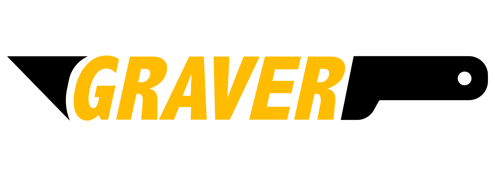

## Graver 是什么
Graver 是一款高效的 UI 渲染框架，它以更低的资源消耗来构建十分流畅的 UI 界面。Graver 独创性的采用了基于绘制的视觉元素分解方式来构建界面，得益于此，该框架能让 UI 渲染过程变得更加简单、灵活。

## 功能特点

- **性能表现优异**

Graver 在 FPS、CPU、Memory 各方面的指标均表现优异。

- **“一站式”异步化**

Graver 从文本计算、样式排版渲染、图片解码，再到绘制，实现了全程异步化，并且是线程安全的。使用 Graver 可以一站式获得全部性能优化点。

- **性能消耗的“边际成本”几乎为零**

Graver 渲染整个过程除画板视图外完全没有使用 UIKit 控件，最终产出的结果是一张位图（Bitmap），视图层级、数量大幅降低。

- **渲染速度快**

Graver 并发进行多个画板视图的渲染、显示工作。得益于图文混排技术的应用，达到了内存占用低，渲染速度快的效果。由于排版数据是不变的，所以内部会进行缓存、复用，这又进一步促进了整体渲染效率。Graver 既做到了高效渲染，又保证了低时延页面加载。

- **以“少”胜“繁”**

Graver 重新抽象封装 CoreText、CoreGraphic 等系统基础能力，通过少量系统标准图形绘制接口即可实现复杂界面的展示。

- **基于位图（bitmap）的轻量事件交互系统**

如上述所说，界面展示从传统的视图树转变为一张位图，而位图不能响应、区分内部具体位置的点击事件。Graver 提供了基于位图的轻量事件交互系统，可以准确识别点击位置发生在位图的哪一块“绘制单元”内。该“绘制单元”可以理解为与我们一贯使用的某个具体UI控件相对应的视觉展示。使用 Graver 为某一视觉展示添加事件如同使用系统 UIButton 添加事件一样简单。

- **全新的视觉元素分解思路**

Graver 一改界面编程思路，与传统的通过控件“拼接”、“添加”，视图排列组合方式构建界面不同，它提供了十分灵活、便捷的接口让我们以“视觉所见”的方式构建界面。

## 了解更多
1. [框架概述](FrameworkOverview.md)
2. [为 Graver 贡献代码](CONTRIBUTING.md)

## 系统需求
- iOS 9.0 +
- Xcode 9.0 +

## 如何运行示例项目
在 Clone 项目后，执行 `pod install` ，然后打开 GraverDemo.xcworkspace 。

## 安装
CocoaPods 在 Podfile 中添加 `pod 'Graver'` ，然后运行 `pod install` 即可。

## 许可证
Graver 使用 [Apache Public License 2.0 许可证](./LICENSE)。

## 更新日志
[更新日志](CHANGELOG.md)

## 相关文章

关于 Graver 的发展背景和过程，可参考美团技术博客 [美团开源Graver框架：用“雕刻”诠释iOS端UI界面的高效渲染](https://tech.meituan.com/waimai_graver.html)。

## 其他

有兴趣一起雕琢艺术品吗？欢迎投递简历到 [it_graver@meituan.com](mailto:it_graver@meituan.com) ，加入我们的团队！

微信交流群：

加下方小助手微信，自动通过后输入 “Graver” 即可加入微信交流群。

